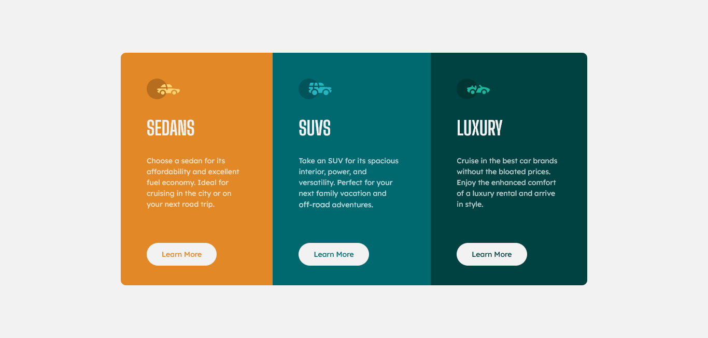

# Frontend Mentor - 3-column preview card component solution

This is a solution to the [3-column preview card component challenge on Frontend Mentor](https://www.frontendmentor.io/challenges/3column-preview-card-component-pH92eAR2-). Frontend Mentor challenges help you improve your coding skills by building realistic projects. 

## Table of contents

- [Overview](#overview)
  - [The challenge](#the-challenge)
  - [Screenshot](#screenshot)
  - [Links](#links)
- [My process](#my-process)
  - [Built with](#built-with)
  - [What I learned](#what-i-learned)
  - [Continued development](#continued-development)
- [Author](#author)

## Overview

### The challenge

Users should be able to:

- View the optimal layout depending on their device's screen size
- See hover states for interactive elements

### Screenshot



### Links

- Solution URL: https://github.com/SrCienpies/3-column-preview
- Live Site URL: https://srcienpies.github.io/3-column-preview/

## My process

### Built with

- Semantic HTML5 markup
- SASS
- Flexbox
- Mobile-first workflow

### What I learned

I use this project to learn how to use SASS to style the webpage. To achieve this first i used VSCODE with **Live Sass Compiler** extension but then i decided to use PREPROS just to learn different ways to compile SASS.

Also i lear the nobr tag for words with hypens in the middle like "off-road".

```html
<nobr>off-road</nobr>
```

### Continued development

Even when i am satisfied whit the use of SASS i will continue practicing and applying different concepts like mixing and nesting to achieve a better handling of this tool.


## Author

- Github - [Diego De Tomás](https://github.com/SrCienpies)
- Frontend Mentor - [@SrCienpies](https://www.frontendmentor.io/profile/SrCienpies)
